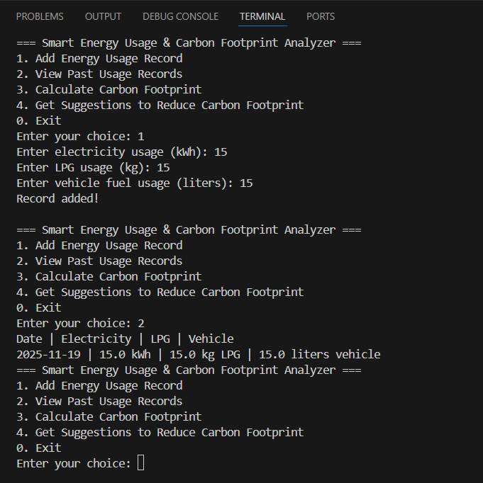
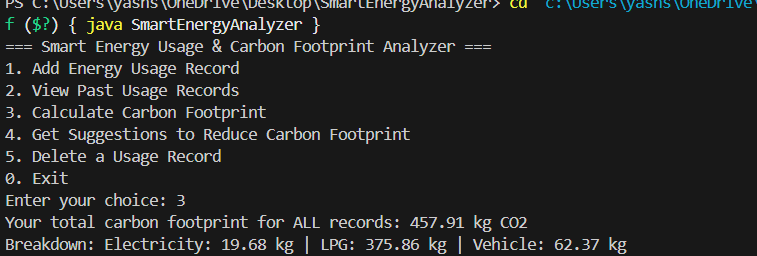
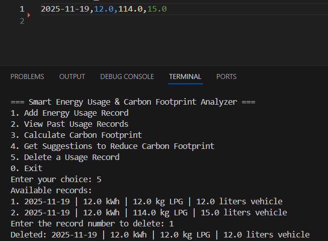
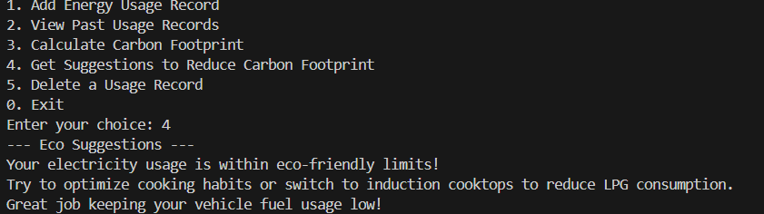

# Smart Energy Usage & Carbon Footprint Analyzer

**Track your household energy usage and carbon footprint, compare to eco-standards, and get actionable suggestions to reduce your impact.**

## Setup
- Java 11+ required.
- Run `src/SmartEnergyAnalyzer.java` as the entry point.

## ⚡ Features

- **Add usage records**: Track electricity (kWh), LPG (kg), and vehicle fuel (liters).
- **View usage history**: See all past energy inputs (persistent, CSV file-based).
- **Carbon footprint analyser**: Instant breakdown and total for all records.
- **Eco-suggestions**: Get personalized advice based on your footprint.
- **Delete records**: Remove unwanted or incorrect entries.
- **Persistent storage**: Data saved in `db/records.csv` across sessions.
- **(Optional)**: Daily reminder feature (thread), simple text charts.

## Author
- Yash Shah (24BSA10024)

## 🚀 Setup Instructions

1. **Requirements**:  
   - Java 11 or higher

2. **Clone the repository**:  
    -git clone https://github.com/yashcodes8009/SmartEnergyAnalyzer.git
3. **Create the `db` folder in your project root if it doesn't exist.**

4. **Compile the source files:**

cd src
javac model/UsageRecord.java
javac model/CarbonAnalyzer.java
javac SmartEnergyAnalyzer.java

5. **Run the program:**

java SmartEnergyAnalyzer

---

## 📂 Project Structure

SmartEnergyAnalyzer/
├── db/
│   └── records.csv
├── src/
│   ├── SmartEnergyAnalyzer.java
│   └── model/
│   ├── UsageRecord.java
│   └── CarbonAnalyzer.java
├── README.md
├── .gitignore

---

## 🖼️ Screenshots

Add screenshots in a `screenshots` folder and reference a few below for your report/demo:

- Adding a record
- Viewing usage records
- Carbon footprint calculation
- Suggestions output
- Deleting a record
- CSV file view

